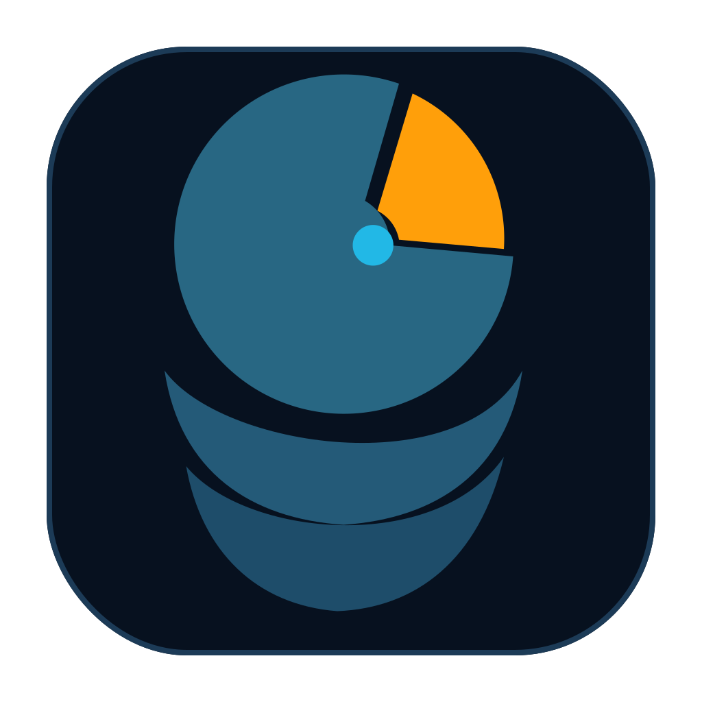

<p align="center">
  
</p>

# DiskDeck

See where your disk went. Take it back.

A pure-Rust macOS disk-space visualizer and safe reclaimer built with egui —
one small native binary, no WebView, GPU-rendered at display refresh rate.
Memory-safe by construction:
the scanner threads and the UI share the live tree through atomics and the
compiler proves there are no data races.

## Why DiskDeck

- **The terrain map grows live during the scan.** File sizes bubble up the
  tree through atomics the moment they're statted, and the GPU repaints every
  frame — you watch the disk materialize instead of waiting for a completed
  scan.
- **Free up a specific amount safely** — choose 10 GB, 20 GB, 50 GB, or a
  custom goal. DiskDeck builds a deterministic Safe-only plan, explains any
  shortfall, leaves Caution findings unchecked, and reports actual free space
  separately from estimates or items still waiting in Trash.
- **See what grew** — completed scans keep a compact local baseline and show
  the total change plus the largest ≥10 MB growers on the next scan.
- **Growth Watch and Storage Forecasting** — inspect a 12-scan timeline,
  recurring growers, and folder watchlist, then see whether storage is steady,
  improving, volatile, already low, or trending toward the configured
  low-space threshold. A time range requires at least three compatible scans
  spanning seven days; confidence advances from Early (3/7) to Developing
  (5/14) and Reliable (8/30). DiskDeck uses local completed scans only and
  never starts an always-on background scan.
- **Developer Deep Dive** — opt into an evidence-first workspace for Docker,
  Xcode, projects, package stores, and build tooling. Docker's fixed read-only
  `system df` detail is labelled “inside Docker” and never added to the
  measured filesystem footprint. Project grouping reuses the retained scan
  tree, examines at most 200 large candidates, and checks only five immediate
  standard markers per candidate—never another recursive disk walk.
- **Honest APFS accounting** — separate measured container capacity/free
  space and local snapshot count from file recommendations. Snapshot byte size
  and purgeable capacity stay explicitly unavailable when macOS does not
  report reliable exact values; neither is advertised as reclaimable.
- **Conservative app leftovers** — inspect large per-app sandbox containers
  only when their directory is an exact bundle identifier and no installed app
  or extension can be verified. Findings are Caution and read-only; uncertain
  matches are omitted.
- **Optional menu-bar monitor** — show free space with five-minute updates and
  a local low-space threshold without running scans. Menu-bar display and
  launch at login are separate opt-ins and both default off.
- **Opt-in duplicate and large-old review** — scan standard user folders only
  when requested, prove duplicate groups byte-for-byte, and surface ≥1 GB
  files with access metadata older than 180 days. Results provide Quick Look
  and Finder reveal only; no copy is selected or removed.
- **DaisyDisk-style zoom** — drilling into a region animates it expanding to
  fill the view. A visible Back button and clickable breadcrumbs make the
  route home obvious.
- **Native light and dark appearances** — DiskDeck follows the macOS system
  appearance automatically while preserving the same hierarchy and safety
  meaning in both modes.
- **Discoverable map actions** — right-click a real map item for Open, Reveal
  in Finder, and Move to SSD instead of memorizing modifier-key shortcuts.
- **Verified SSD offload** — move a home-folder item to an external drive,
  verify the copy, then optionally leave a symlink at the original path.
  Library data, hidden roots, cloud-sync folders, app/media bundles, and
  symlinked paths are refused in both the UI and background worker.
- **Moved Items and verified restore** — every successful offload is recorded
  locally, reconciled with attached drives, and classified before the Restore
  button is enabled. Restore copies back to a staging path, verifies it,
  installs it at the original location, rechecks the external item, and only
  then removes the external copy.
- One self-contained native binary; no webview runtime, no bindings layer.

Safety is structural, not advisory:
- 🟢 safe / 🟡 caution tiers; caution never pre-checked; user files never proposed
- per-item action choice: Trash (recoverable) ↔ permanent erase; Docker/Go-style
  reclaims run their exact vetted command, shown verbatim
- nothing is removed without a ticked checkbox **and** the 900 ms hold
- trash = instant same-volume rename into `~/.Trash` (no Automation prompt);
  Finder fallback only
- SSD moves refuse an existing destination and recheck the original's
  filesystem identity immediately before removal
- restores require an acknowledgement and 900 ms hold; an occupied origin,
  disconnected drive, missing/replaced target, unsafe symlink, or insufficient
  internal space blocks the operation before copying
- move history stays local under DiskDeck's Application Support directory;
  raw macOS path bytes round-trip losslessly and corrupt records are never
  overwritten
- Growth Watch choices use a separate bounded, lossless local file; they
  update only when you pin/unpin a measured folder, and measurements advance
  only after a completed scan
- scan history stays local under DiskDeck's Application Support directory;
  only the 12 newest compact completed-scan snapshots are retained. New
  snapshots include local volume capacity for forecasting; older DDHIST1
  snapshots remain valid for growth comparisons but do not count as forecast
  evidence
- Developer Deep Dive is read-only: discovered project output can be revealed
  but never becomes a cleanup rule, command, selection, or reclaimable claim;
  only existing vetted recommendations retain their existing actions

## Installation

**Requirements:** Apple Silicon Mac, macOS 12+. You'll receive
`DiskDeck.zip` containing the app **and a one-time installer**.

### The easy way (recommended)

1. Unzip. You'll see `DiskDeck.app` and `Install DiskDeck.command`.
2. **Right-click `Install DiskDeck.command` → Open → Open.** (That
   right-click is the only Gatekeeper dance you'll ever do.)

The installer then handles everything that used to cause repeated permission
prompts: it copies the app to /Applications, clears the download-quarantine
flag, opens System Settings on the **Full Disk Access** pane (toggle
**DiskDeck** ON — click **+** and pick it from /Applications if it isn't
listed), and launches the app. Hit **RESCAN** after granting and you're done —
**macOS never asks again.**

### The manual way

1. Drag `DiskDeck.app` to /Applications.
2. Right-click the app → Open → Open (or, on newer macOS: System Settings →
   Privacy & Security → *"DiskDeck" was blocked…* → **Open Anyway**).
3. In the app, click **FULL DISK ACCESS** (top right), toggle DiskDeck ON,
   then **RESCAN**.

> **Safety promise:** the scan is read-only. DiskDeck never deletes
> anything by itself — every removal requires you to tick its checkbox *and*
> hold the reclaim button for a second. File items go to the **Trash** by
> default (recoverable until you empty it); only items you explicitly flip to
> ERASE are removed outright, and command-based reclaims (Docker, Go) show
> the exact command they run before you arm them.

## Why did it keep asking for permissions before?

macOS ties permission grants to an app's **code signature + bundle id**.
Unsigned/ad-hoc builds get a new identity every compile, so the system treats
each rebuild as a brand-new app and re-asks for every folder. DiskDeck is
signed with a stable certificate and a fixed bundle id
(`com.buddyhq.headroom-rs`), and the installer adds the one **Full Disk
Access** grant that supersedes all per-folder prompts. One grant, forever.

## FAQ

**NO ACCESS still shows ~185 after granting Full Disk Access. Why?**
Two different gates exist. *Privacy permissions* (what FDA clears) guard your
personal folders — granting it drops the count by a couple hundred. The
remainder are **root-only system directories** (Spotlight index, filesystem
journal `.fseventsd`, root's home, audit logs). No app you run can read those,
by design, and there's nothing reclaimable inside. Hover the NO ACCESS counter
in-app for this same explanation.

**I reclaimed items but free space didn't move.**
Trash items don't free space until the Trash is emptied — that's what makes
them recoverable. Select the **Trash** target and reclaim again (or empty it
in Finder).

**What does ≈ next to a size mean?**
Upper bound, not exact — e.g. Docker's number is everything its VM holds;
the prune removes only the unused part.

**Why is Playwright (or some item) unchecked?**
🟡 caution items cost a re-download/re-install, so they're never pre-armed.
Click any row's title to expand what it is, what restoring costs, and exactly
how it gets removed.

**Does it ever touch my code, photos, documents?**
No. The reclaim plan only proposes caches, build artifacts, logs, package
stores, and `node_modules`. Your files appear in the terrain map (that's the
point) but are never suggested for deletion.

## Controls

| Gesture | Action |
|---|---|
| click folder region | open it with an animated zoom |
| right-click region | open the actions menu: Open, Reveal in Finder, Move to SSD… |
| click Back | return to the previous folder; disabled at the Data root |
| click a breadcrumb | jump directly to that ancestor |
| press Esc | close an open actions menu; otherwise return one folder |
| click rec title | expand explainer |
| click action chip | toggle → TRASH / ERASE |
| click Free up space | choose a goal and build a Safe-only guided plan |
| click a goal preset / Use custom goal | recalculate the local plan without touching files |
| click Review this plan | apply only the proposed Safe checkboxes, then inspect every target |
| click Safe caches / Needs review | open all reclaim targets for manual review |
| click Insights | open the bounded local-insights hub |
| click Moved items in Insights | inspect offloaded items and their restore readiness |
| click Growth Watch in Insights | inspect retained scan trends, recurring growers, and the local storage forecast |
| click Scan now in Growth Watch | explicitly start a foreground read-only scan when forecast evidence is insufficient |
| click Developer Lens in Insights | open the read-only Docker, Xcode, project, package, and build workspace |
| click Evidence in Developer Deep Dive | inspect source path, measurement, tier, recovery, overlap handling, and display-only vetted command |
| click APFS accounting in Insights | inspect container capacity and snapshot accounting |
| click App leftovers in Insights | inspect evidence-backed sandbox leftovers; reveal only |
| click Menu-bar monitor in Insights | opt into the native readout, threshold, or login launch |
| click Duplicate & large-old review in Insights | open the off-by-default review; Start explicitly |
| click Watch / Unwatch | update the local folder watchlist |
| click Restore to Mac… | review why an item can or cannot be restored |
| hold restore button 0.9 s | restore one acknowledged, preflighted item |
| hold reclaim button 0.9 s | execute the plan |

## Build from source

```sh
cargo test          # scanner, rules KB, cleaner, offload, and treemap tests
./make-app.sh       # release build + bundle + codesign + install + dist zip
cargo run           # dev run (unbundled; FDA grants won't apply to it)
```

Requires Rust 1.80+. **Ship via `make-app.sh` only** — bare `cargo build`
output is unsigned, and every unsigned build re-triggers the permission
prompts described above. The script signs with a stable identity (override
with `DISKDECK_SIGN_IDENTITY`; the legacy `HEADROOM_SIGN_IDENTITY` override is
also supported), installs to `/Applications/DiskDeck.app`, and packages
`dist/DiskDeck.zip` with the recipient installer included.

UI contributors can reproduce the maintainers' navigation and context-menu
checks with the tracked, non-destructive AppleScript workflow documented in
[CONTRIBUTING.md](CONTRIBUTING.md#signed-ui-smoke-check).

## Development & maintenance

**Maintainers (human or AI): read [AGENTS.md](AGENTS.md) first.** It carries
the invariants (vetted-commands-only, the never-change bundle id, the
rename-first trash ordering, tier policy) and the hard-won egui gotchas —
most notably the font-fallback/tofu lesson and why the icon has no track arc.

### Tests

| Suite (in-module `#[cfg(test)]`) | What it proves |
|---|---|
| `scan.rs` | counts & aggregation, post-scan compaction folds small dirs, hardlinks counted once, denied dirs counted but non-fatal, nested `node_modules` not double-reported |
| `rules.rs` | KB doctrine on a synthetic tree: tiers, Trash=empty-not-trash, ≥50 MB cache floor + skip-list, Library `node_modules` excluded, safe-before-caution ordering, every rec carries explainers, `~` path prettification |
| `clean.rs` | quick_du, write-protected delete, empty-keeps-dir, output tailing, command timeout |
| `history.rs` | lossless snapshot/watchlist codecs, corruption handling, compact-tree capture, comparison threshold/order, recurring-growth timeline, atomic retention without touching unrelated files |
| `forecast.rs` | compatible-capacity filtering, exact 3/7–5/14–8/30 confidence gates, robust median loss rate, uncertainty range, and honest non-estimate states |
| `developer.rs` | rebuild-cost labels, source evidence, overlap-safe totals, capped retained-tree project grouping, fixed Xcode inventory, Docker size parsing, fixed-command timeout/failure, and inside-VM non-counting |
| `apfs.rs` | fixed-command APFS plist parsing, bounded values, snapshot count, and timeout/failure behavior |
| `leftovers.rs` | bundle-ID policy, ≥250 MB floor, exact installed-app absence proof, conservative omission |
| `monitor.rs` | versioned settings, native AppKit status item, threshold semantics, user LaunchAgent |
| `file_review.rs` | bounded opt-in traversal, hardlink dedup, streamed fingerprint plus byte proof, large-old metadata |
| `transfer.rs` | shared collision, filesystem-identity, apparent-size, and verified-copy primitives |
| `offload.rs` | protected-path policy, worker revalidation, destination collision, source identity, capacity margin, verified moves, symlink behavior, local move-record persistence, event ordering |
| `moves.rs` | lossless registry codec, atomic bounded storage, legacy-ledger import, health classification, restore preflight, rollback, and worker events |
| `treemap.rs` | squarified layout conserves area, stays in bounds, degenerate inputs |

### Release checklist

1. `cargo test` green
2. `./make-app.sh` (builds, signs, installs, zips with installer)
3. Launch, scan, spot-check the reclaim plan and the live map
4. Share `dist/DiskDeck.zip`

### Commit safety

Enable the tracked privacy and secret guard once per clone:

```sh
git config core.hooksPath .githooks
scripts/test-pre-commit.sh
scripts/test-pre-push.sh
```

The hook rejects credential-shaped strings, private keys, unapproved email
addresses, machine-specific absolute paths, AppleDouble metadata, `.env`
files, app bundles, and generated build output. Before personal GitHub pushes,
it also rejects BuddyHQ-authored commit history so local archive branches
cannot be published accidentally.

## Project history

Born 2026-06-12 after a manual cleanup session recovered ~70 GB. The v2
roadmap shipped as independently verified slices: regrowth history, verified
move-back, Growth Watch, Developer Lens, honest APFS accounting, conservative
app leftovers, the opt-in menu-bar monitor, and read-only duplicate/large-old
review.

Fonts: Inter (SIL OFL, see `assets/fonts/LICENSE.txt`) for the native-width UI;
paths and scan data use egui's built-in Hack.

Brand source: `assets/logo.svg` is the approved transparent standalone mark.
`assets/AppIcon.icon` supplies Default, Dark, and Mono/Tinted macOS 26
appearances. `scripts/render-icon.cjs` synchronizes its SVG layers and derives
the universal blue fallback at `assets/icon.svg` and `assets/icon.png`;
`assets/DiskDeck.icns` is produced by `make-app.sh` for macOS 12–15 and builds
without Xcode 26. When Xcode 26 is available, `make-app.sh` also compiles the
adaptive icon into the app's `Assets.car`.

## License

DiskDeck is open source under the [Apache License 2.0](LICENSE).
